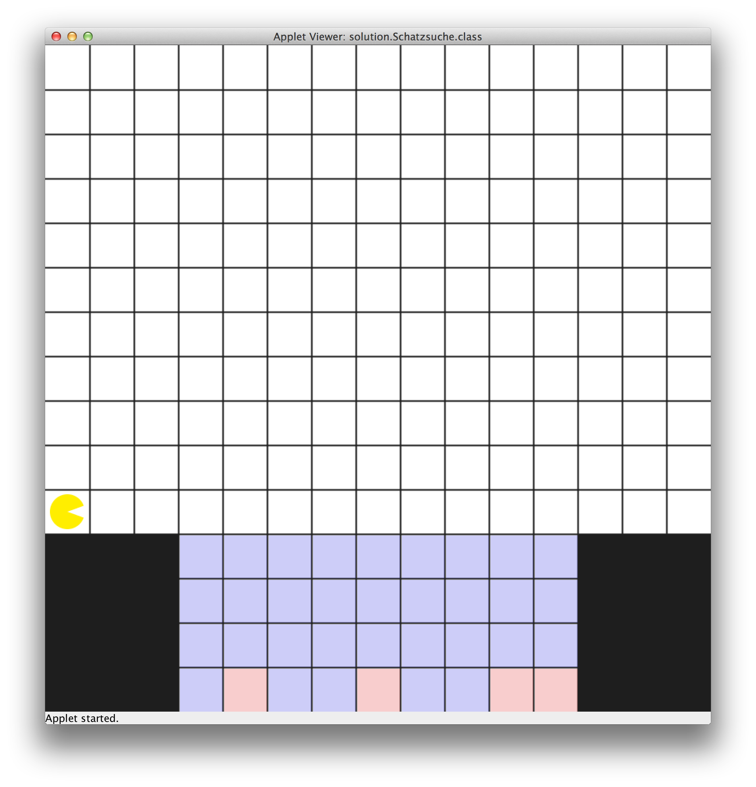
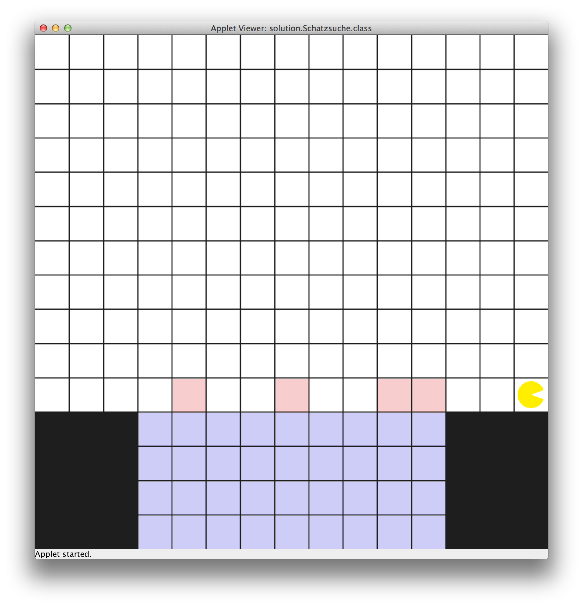

# U05 | Bouncer auf Schatzsuche

## Ausgangslage
| Der See bevor Bouncer alle Schätze geborgen hat. | Der See nachdem Bouncer alle Schätze geborgen hat. |
| ------------------------------------------------ | -------------------------------------------------- |
|  |  |

Bouncer steht in dieser Aufgabe vor einem See, in dem eine Reihe von
versunkenen Schätze auf dem Grund liegen (*rote Felder*). Bouncers
Aufgabe ist es, zu diesen Schätzen zu tauchen, sie an die Oberfläche des Sees zu befördern und dort treiben zu lassen. Dazu muss Bouncer den gesamten Grund des Sees untersuchen, jeden Schatz aufnehmen (*Das rote
Feld blau einzeichnen*) und mit den einzelnen Schätzen senkrecht nach
oben tauchen. Über der Wasseroberfläche soll Bouncer den gefunden Schatz
ablegen (*Das entsprechende Feld rot färben)*. Die Schätze liegen immer
auf dem Grund des Sees, es können allerdings unterschiedliche viele sein
und ihre Position ist unbekannt. Sie müssen eine Lösung programmieren,
die für beliebige Karten funktioniert. Links und rechts vom See befindet
sich dabei immer ein drei Felder breites Ufer - die Tiefe des Sees ist
nicht bekannt, über der Wasseroberfläche ist aber immer mindestens ein
Feld bis zum oberen Kartenrand frei. Zu Beginn startet Bouncer am linken
Ufer und am Ende soll er den rechten Kartenrand erreichen (Siehe
Grafik).

## Aufgabe
Die Aufgabe besteht daraus, die Kommandos für Bouncer zu schreiben, um
die folgenden Teilaufgaben zu lösen.

1.  Eintauchen in den See

2.  Durchsuchen des Seegrunds nach Schätzen

3.  Bergen der einzelnen Schätze, in dem diese an die Oberfläche
    gebracht werden

4.  Auftauchen aus dem See und erreichen des rechten Ufers.

**Hinweise:** Schreiben Sie eine eigene `private`-Methode für jeden der
oben dargestellten Schritte. Teilen Sie die identifizierten Teilprobleme
nötigen Falles auf weitere Methoden auf. Beachten Sie dabei die, in der
Vorlesung angesprochenen Verfahren des Top-Down-Ansatzes sowie der
Decomposition. Achten Sie darauf, sowohl den Code als auch die
Kommentare (z.B. *pre*- und *post-conditions*) in Englisch zu schreiben.
Verwenden Sie aussagekräftige Bezeichnungen für Ihre eigenen Methoden.
Ein Tipp: Das Bergen eines einzelnen Schatzes unterbricht die größere
Aufgabe des Suchens auf dem Seegrund. Nach dem erfolgreichen Bergen muss
Bouncer die Suche nach den anderen Schätzen an der richtigen Stelle
fortsetzen.
